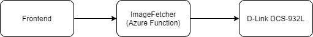

https://github.com/the-mikael-johansson/birdhouse/actions/workflows/ci-pipeline.yml/badge.svg

# Birdhouse with surveillance system

This project contains the software used in my birdhouse with a IP-camera (D-Link DCS932L) that monitors the birds.

# System overivew

